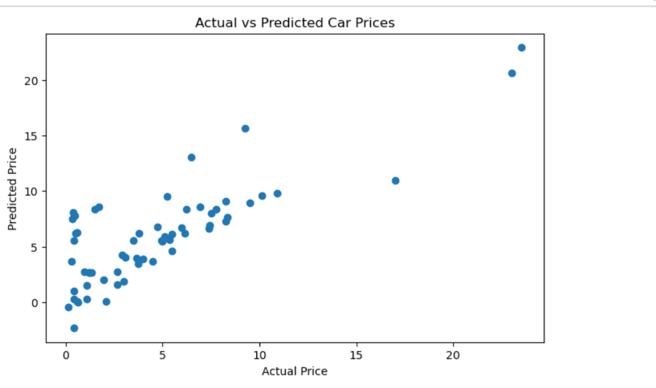

# Stuti_Task-3
Car price analysis and prediction using Python and machine learning.

# Car Price Analysis and Prediction

## Task Information
- **Task Number:** Task 3
- **Project Name:** Car Price Analysis and Prediction
- **Author:** Stuti Bakrania

---

## Project Objective
The objective of this project is to analyze car data and build a machine learning model for car price prediction using Python.

---

## Dataset Used
- Car_Data.csv

The dataset contains information related to:
- Car Name
- Year
- Selling Price
- Present Price
- Fuel Type
- Transmission
- Owner

---

## Technologies & Libraries Used
- Python
- Pandas
- NumPy
- Matplotlib
- Seaborn
- Scikit-learn

---

## Project Workflow
1. Importing required libraries
2. Loading dataset
3. Data preprocessing
4. Exploratory Data Analysis (EDA)
5. Data visualization
6. Feature engineering
7. Model training
8. Prediction and evaluation

---

## Files Included
- `Stuti_Task3.ipynb`
- `Car_Data.csv`
- `README.md`
- 

---

## Output
The project analyzes car market data and predicts car selling prices using machine learning techniques.

---
## Output Screenshot

